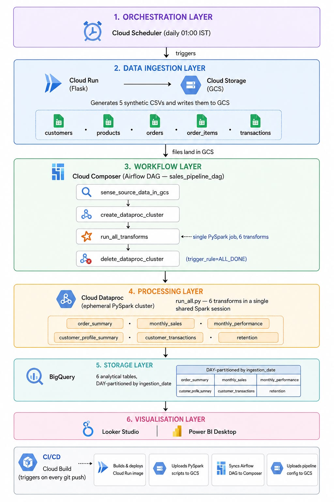

# GCP Batch Data Pipeline

<p align="center">
  
  
  
  
  
  
  
</p>

<p align="center">
  <strong>Production-grade GCP batch data pipeline — from synthetic data generation all the way to BI-ready BigQuery tables.</strong><br/>
  Cloud Run → Cloud Storage → Dataproc (PySpark) → BigQuery, orchestrated by Cloud Composer (Airflow) and automated end-to-end with Cloud Build CI/CD.
</p>

---

## What this project covers

This is a complete, end-to-end batch data engineering project built entirely on Google Cloud Platform. It was designed to mirror how batch pipelines are built and operated in production environments.

| Skill area | How it's applied here |
|---|---|
| **Distributed processing** | PySpark on Dataproc — joins, window functions, aggregations across 5 datasets |
| **Workflow orchestration** | Airflow DAG (Cloud Composer) with GCS sensor, deferrable operators, and trigger rules |
| **Cloud-native architecture** | Ephemeral Dataproc cluster, Cloud Run data generator, GCS as the data lake |
| **Data warehousing** | 6 analytical tables in BigQuery, DAY-partitioned, append-mode writes |
| **CI/CD for data pipelines** | Cloud Build automates Docker build, Cloud Run deploy, PySpark uploads, and DAG sync on every push |
| **Data modelling** | 6 purpose-built analytical tables covering orders, sales trends, customer profiles, and retention |
| **Production patterns** | Config-driven pipeline, ephemeral clusters, cost-aware design, deferrable operators |
| **Containerisation** | Flask data generator packaged in Docker and deployed to Cloud Run |
| **BI integration** | Outputs plug directly into Looker Studio or Power BI |

---

## Architecture




---

## Airflow DAG

The `sales_pipeline_dag` is composed of four tasks wired in a linear chain. Below is a screenshot of the DAG as it appears in the Cloud Composer (Airflow) UI:


| Task | Operator | Purpose |
|---|---|---|
| `sense_source_data_in_gcs` | `GCSObjectExistenceSensorAsync` | Waits for `orders.csv` to confirm data generation is complete |
| `create_dataproc_cluster` | `DataprocCreateClusterOperator` | Provisions an ephemeral Dataproc cluster (`use_if_exists=True`) |
| `run_all_transforms` | `DataprocSubmitJobOperator` | Submits `run_all.py` — runs all 6 PySpark transforms in one Spark session |
| `delete_dataproc_cluster` | `DataprocDeleteClusterOperator` | Tears down the cluster (`trigger_rule=ALL_DONE` — runs even on failure) |

All operators use `deferrable=True` to release the Airflow worker slot during long Dataproc waits.

---

## Tech stack

| Layer | Technology |
|---|---|
| Data generation | Python · Flask · Faker · Pandas · Docker · Cloud Run |
| Data lake | Google Cloud Storage (GCS) |
| Orchestration | Apache Airflow 2.x (Cloud Composer) |
| Distributed processing | Apache Spark 3.x (PySpark) · Cloud Dataproc |
| Data warehouse | Google BigQuery |
| CI/CD | Cloud Build · Artifact Registry |
| BI / Dashboards | Looker Studio · Power BI Desktop |
| Config management | JSON config stored in GCS, read at DAG parse time |

---

## Repository structure

```
.
├── airflow/
│   └── sales_pipeline_dag.py       # Airflow DAG — orchestrates the full pipeline
├── config/
│   └── config.json                 # Pipeline config (uploaded to GCS on every build)
├── data_generator/
│   ├── main.py                     # Flask app — generates 5 synthetic CSVs
│   ├── Dockerfile
│   └── requirements.txt
├── pyspark/
│   ├── utils.py                    # Shared helpers: Spark session, BQ writer, 5 data cleaners
│   ├── run_all.py                  # Production entry point — runs all 6 transforms in one session
│   ├── order_summary.py            # Per-order totals, items, top category, payment, transaction
│   ├── monthly_sales.py            # Revenue by year/month/region/category
│   ├── monthly_performance.py      # Order volume and revenue trends by month
│   ├── customer_profile_summary.py # Lifetime value and segment per customer
│   ├── customer_transactions.py    # Transaction history linked to orders
│   └── customer_retention.py      # New vs returning customer analysis
├── cloudbuild.yaml                 # CI/CD — build, push, deploy, upload artifacts
└── README.md
```

---

## Pipeline outputs

### Raw data (GCS)

The Cloud Run data generator writes five CSVs to GCS on every run:

```
gs://<gcs_bucket>/synthetic_data/
    customers.csv        — 1,000 customers (id, name, email, signup_date, region, segment)
    products.csv         — 500 products  (id, name, category, sub_category, brand, unit_price)
    orders.csv           — 5,000 orders  (id, customer_id, date, status, amount, discount, payment)
    order_items.csv      — 2,000 items   (id, order_id, product_id, quantity, price_per_unit)
    transactions.csv     — 5,000 txns    (id, order_id, date, amount, status)
```

Files use fixed names (no date suffix). The `ingestion_date` partition column in BigQuery tracks when each batch was loaded.

### Analytical tables (BigQuery)

All six tables are written in **append mode**, partitioned by `ingestion_date` (DAY):

| Table | Description | Key fields |
|---|---|---|
| `order_summary` | Enriched per-order view — joins all 5 datasets | order totals, discount %, net amount, top category, transaction status |
| `monthly_sales` | Revenue breakdown by month, region, and category | gross_revenue, units_sold, avg_order_value |
| `monthly_performance` | Order volume and revenue trend by month | total_orders, completed_orders, revenue |
| `customer_profile_summary` | Customer lifetime value and segment analysis | total_spend, order_count, avg_order_value, segment |
| `customer_transactions` | Transaction history joined to orders | transaction_date, amount, status, order details |
| `customer_retention` | New vs returning customer cohort analysis | new_customers, returning_customers, retention_rate |

---

## How the pipeline runs

### Step 1 — Data generation (Cloud Run)

A Flask app deployed on Cloud Run is triggered by Cloud Scheduler at **01:00 IST** daily.

`POST /generate` produces the 5 CSV files above, written directly to GCS using the `GCS_BUCKET` and `GCS_PREFIX` environment variables. The app also exposes `GET /health` for Cloud Run health checks.

Run locally without GCS (outputs to `synthetic_data/`):
```bash
cd data_generator
pip install -r requirements.txt
python main.py
```

### Step 2 — Orchestration (Airflow DAG)

The `sales_pipeline_dag` runs daily at **20:30 UTC (02:00 IST)** — after the data generator completes:

```
sense_source_data_in_gcs   ← GCS sensor waits for orders.csv to confirm generation is done
         │
create_dataproc_cluster    ← ephemeral cluster (use_if_exists=True handles reruns cleanly)
         │
run_all_transforms         ← single Dataproc PySpark job running all 6 transforms
         │
delete_dataproc_cluster    ← trigger_rule=ALL_DONE ensures cleanup even on failure
```

All operators use `deferrable=True` so the Airflow worker releases its slot during long Dataproc waits, preventing Cloud SQL proxy heartbeat timeouts.

DAG config (cluster name, bucket, schedule, etc.) is read from `gs://<bucket>/config/config.json` at parse time via the `GCS_CONFIG_PATH` environment variable — no DAG code changes needed to update infra settings.

### Step 3 — PySpark transforms (Dataproc)

`run_all.py` is submitted as a single Dataproc job. It:

1. Reads and cleans all 5 CSVs once
2. Caches shared DataFrames in memory
3. Runs all 6 transform functions in sequence within the same Spark session
4. Writes each result to BigQuery (append mode, DAY-partitioned)
5. Prints a pass/fail summary and exits non-zero if any transform fails

Each transform module exposes a `transform(**kwargs)` function that receives only the DataFrames it needs — `order_summary` gets all 5, `customer_retention` only needs `orders` and `customers`.

---

## Deployment guide

### Prerequisites

- Google Cloud project with billing enabled
- APIs enabled: Cloud Run, Dataproc, BigQuery, Cloud Composer, Cloud Build, Artifact Registry
- `gcloud` CLI installed and authenticated (`gcloud auth login`)
- A custom VPC with two firewall rules (see [Networking](#networking))
- Docker (to build the image locally if needed)

### 1. Configure the pipeline

Edit `config/config.json` with your GCP resource values:

```json
{
  "project_id": "YOUR_GCP_PROJECT_ID",
  "region": "us-central1",
  "cluster_name": "YOUR_DATAPROC_CLUSTER_NAME",
  "gcs_bucket": "YOUR_GCS_BUCKET",
  "bq_dataset": "YOUR_BQ_DATASET",
  ...
}
```

Edit `cloudbuild.yaml` substitutions:

```yaml
substitutions:
  _REGION: "YOUR_GCP_REGION"
  _PROJECT_ID: "YOUR_GCP_PROJECT_ID"
  _GCS_BUCKET: "YOUR_GCS_BUCKET"
  _SERVICE_ACCOUNT: "YOUR_SERVICE_ACCOUNT_NAME"
  _BQ_DATASET: "YOUR_BQ_DATASET"
  _COMPOSER_DAGS_BUCKET: "gs://YOUR_COMPOSER_BUCKET/dags"
```

### 2. Create GCP resources

```bash
# Create GCS bucket
gsutil mb -l us-central1 gs://YOUR_GCS_BUCKET

# Create BigQuery dataset
bq mk --dataset YOUR_GCP_PROJECT_ID:YOUR_BQ_DATASET

# Create Artifact Registry repository
gcloud artifacts repositories create data-pipeline-images \
  --repository-format=docker --location=YOUR_GCP_REGION
```

### 3. Set the Cloud Composer environment variable

In your Cloud Composer environment, add the environment variable:

```
GCS_CONFIG_PATH = gs://YOUR_GCS_BUCKET/config/config.json
```

### 4. Connect Cloud Build to your repository

Connect your GitHub repository to Cloud Build and create a trigger on push to `main`. Cloud Build will automatically run `cloudbuild.yaml`.

### 5. Trigger the first build

Push any change to `main`, or manually trigger the build:

```bash
gcloud builds submit --config cloudbuild.yaml .
```

The build will:
- Build and deploy the data generator to Cloud Run
- Upload all PySpark scripts to GCS
- Sync the Airflow DAG to your Composer environment
- Upload `config.json` to GCS

### 6. Set up Cloud Scheduler

Create a Cloud Scheduler job that calls your Cloud Run service:

```bash
gcloud scheduler jobs create http generate-sales-data \
  --schedule="0 1 * * *" \
  --uri="https://YOUR_CLOUD_RUN_URL/generate" \
  --http-method=POST \
  --oidc-service-account-email=YOUR_SERVICE_ACCOUNT@YOUR_PROJECT.iam.gserviceaccount.com \
  --location=YOUR_GCP_REGION
```

---

## CI/CD — Cloud Build

Every push to the repository triggers `cloudbuild.yaml`. Phases 1–3 run sequentially (build → push → deploy). Phases 4–5 run in parallel with Phase 1 (`waitFor: ["-"]`), so artifact uploads happen concurrently with the Docker build.

| Phase | Step | Runs after |
|---|---|---|
| 1 — Build | Docker build for data generator | Immediately |
| 2 — Push | Push image to Artifact Registry | Phase 1 |
| 3 — Deploy | Deploy updated image to Cloud Run | Phase 2 |
| 4 — Upload PySpark | Copy all `pyspark/*.py` to GCS | Immediately (parallel) |
| 5 — Upload DAG | Copy DAG to Composer bucket | Immediately (parallel) |
| 6 — Upload Config | Copy `config.json` to GCS | Phase 4 |

---

## Networking

All resources (Cloud Run, Dataproc, Cloud Composer) share a custom VPC and subnet configured via the `subnetwork` key in `config.json`.

Two firewall rules are required for Dataproc inter-node communication:

| Rule | Direction | Target range | Action |
|---|---|---|---|
| `allow-dataproc-internal` | Ingress | `10.0.0.0/8` | Allow all |
| `allow-dataproc-internal-egress` | Egress | `10.0.0.0/8` | Allow all |

The egress rule is critical — if the VPC enforces a default-deny egress policy, Dataproc worker nodes cannot communicate back to the master and the cluster will fail to initialise.

---

## Dashboards

### Option A — Looker Studio (free, browser-based)

1. Open any BigQuery table in the [GCP console](https://console.cloud.google.com/bigquery)
2. Click **Export → Explore with Looker Studio**
3. Add the remaining 5 tables via **Resource → Manage added data sources**
4. Build charts using the analytical tables below

> Note: Looker Studio may be restricted by your organisation's Google Workspace policy.

### Option B — Power BI Desktop (free, Windows)

1. Install [Power BI Desktop](https://powerbi.microsoft.com/desktop)
2. **Get Data → Google BigQuery** → sign in with your Google account
3. Select your project → your BigQuery dataset → load all 6 tables

Suggested charts:

| Table | Chart type | Key fields |
|---|---|---|
| `monthly_sales` | Line chart | x=month, y=gross_revenue, legend=region |
| `monthly_performance` | Bar chart | x=month, y=total_orders |
| `order_summary` | Scorecard | total_orders, gross_revenue, avg_order_value |
| `customer_profile_summary` | Ranked table | top customers by lifetime value |
| `customer_transactions` | Time series | transaction_date vs transaction_amount |
| `customer_retention` | Pie / stacked bar | returning vs new customers |

---

## Key design decisions

**Single Dataproc job instead of 6 parallel Airflow tasks** — all transforms run in one `run_all.py` job sharing a single Spark session and cached DataFrames. Six separate tasks overwhelmed Airflow worker concurrency limits and caused jobs to fail before even submitting to Dataproc.

**Deferrable operators throughout** — `DataprocCreateClusterOperator`, `DataprocSubmitJobOperator`, and `DataprocDeleteClusterOperator` all use `deferrable=True`. This releases the Airflow worker slot during long Dataproc waits, preventing Cloud SQL proxy connection drops that killed tasks mid-run.

**GCS-backed config read at DAG parse time** — `config.json` lives in GCS and is loaded by the DAG when Composer parses it. Changing cluster specs, schedules, or bucket names requires only a config file update and re-upload — no DAG code changes.

**Ephemeral cluster with `use_if_exists=True`** — the cluster is created at the start of each DAG run and deleted at the end (`trigger_rule=ALL_DONE`), minimising idle compute cost. `use_if_exists=True` makes reruns safe when a previous run's cluster still exists.

**Fixed CSV filenames** — the data generator overwrites the same 5 files on every run rather than creating date-stamped files. Batch tracking is handled by the `ingestion_date` partition column in BigQuery, which keeps GCS clean and avoids prefix-matching complexity in the DAG sensor.

---

## Troubleshooting

| Symptom | Root cause | Fix |
|---|---|---|
| DAG shows `404` for `config.json` | Config not uploaded to GCS yet | Run `gsutil cp config/config.json gs://YOUR_GCS_BUCKET/config/config.json` |
| Dataproc cluster fails — "VM to VM communications blocked" | Missing egress firewall rule | Create `allow-dataproc-internal-egress` (Egress, `10.0.0.0/8`, allow all) |
| Airflow tasks fail before submitting to Dataproc | Worker concurrency limit hit | Use the single `run_all.py` job instead of 6 parallel tasks |
| Cloud Build fails with 401 on `gsutil` step | Auth not propagated to parallel step | Use `gcr.io/cloud-builders/gcloud` with `gcloud storage cp` instead |
| PySpark `FileNotFoundError` for CSV | Script looking for date-suffixed filenames | All CSVs use fixed names (`customers.csv`, not `customers_YYYYMMDD.csv`) |
| Airflow task killed with SQL heartbeat error mid-run | Cloud SQL proxy drops during long Dataproc wait | Set `deferrable=True` on all Dataproc operators |
| Cloud Run `/generate` returns 500 | `GCS_BUCKET` env var not set | Verify `--set-env-vars=GCS_BUCKET=...` in the Cloud Build deploy step |

---

## GCP resources reference

All values are configured in `config/config.json` and `cloudbuild.yaml`:

| Resource | Where to configure |
|---|---|
| Project ID | `config.json → project_id` |
| Region / Zone | `config.json → region`, `zone` |
| GCS Bucket | `config.json → gcs_bucket` |
| BigQuery Dataset | `config.json → bq_dataset` |
| Dataproc Cluster | `config.json → cluster_name` |
| Dataproc cluster specs | `config.json → master_*`, `worker_*` keys |
| Composer DAGs bucket | `cloudbuild.yaml → _COMPOSER_DAGS_BUCKET` |
| Service Account | `cloudbuild.yaml → _SERVICE_ACCOUNT` |
| VPC Subnetwork | `config.json → subnetwork` |

---

## License

This project is licensed under the [MIT License](LICENSE).

---

<p align="center">
  If this project helped you, consider giving it a ⭐ — it helps others find it too.
</p>
